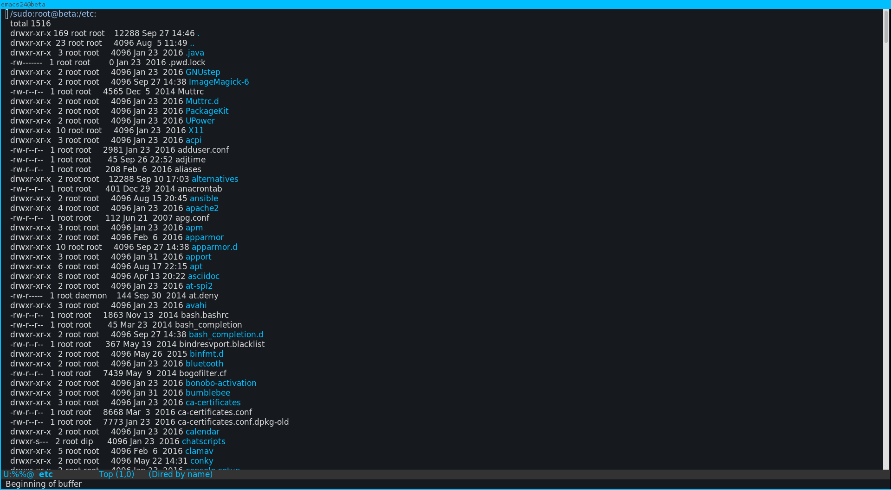
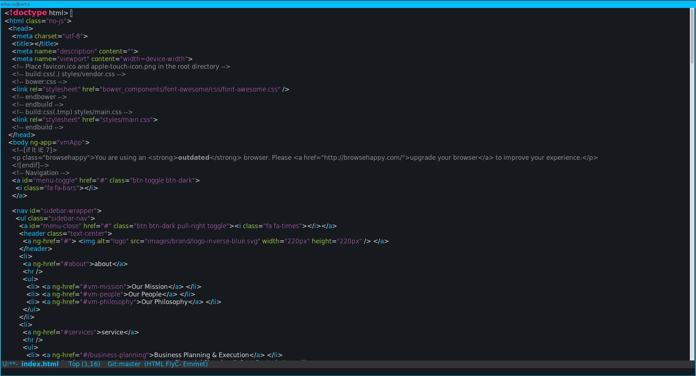
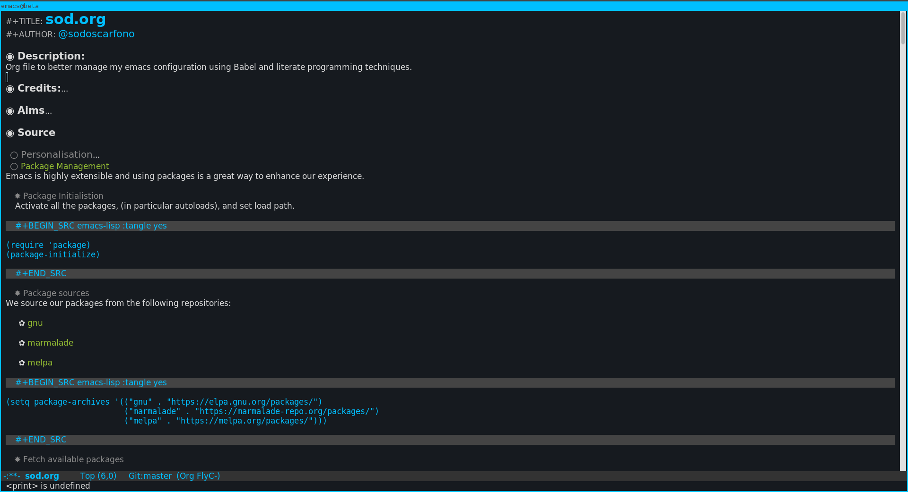

<h2>Table of Contents</h2>

<ul>
<li><a href="#sec-1">1. Screenshots</a></li>
<li><a href="#sec-2">2. Installation</a>
<ul>
<li><a href="#sec-2-1">2.1. Manual</a></li>
<li><a href="#sec-2-2">2.2. Melpa</a></li>
</ul>
</li>
</ul>

# Screenshots

# Installation

## Manual

Download melancholy-theme.el to the directory ~/.emacs.d/themes/.  Add this to your .emacs:

    (add-to-list 'custom-theme-load-path "~/.emacs.d/themes/")

Now you can load the theme with the interactive function load-theme like this:

    M-x load-theme RET melancholy

## Melpa

Melancholy is available in  MELPA.

You can install melancholy with the following command:

    M-x package-install melancholy-theme

or with use-package:

    (use-package melancholy-theme
      :ensure t))

To load it automatically on Emacs startup add this to your init file:

    (load-theme 'melancholy t)
